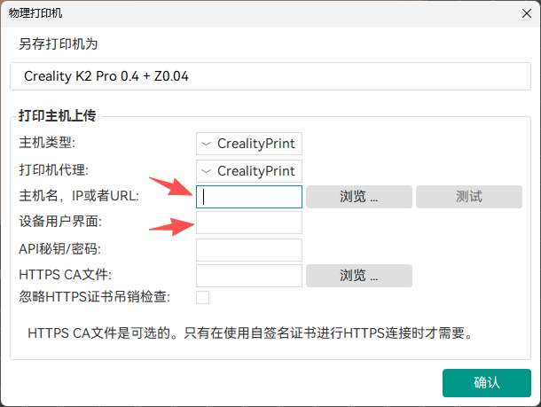
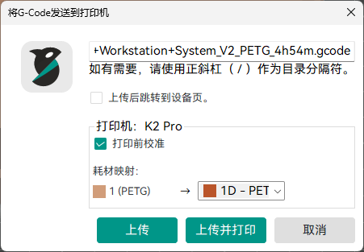
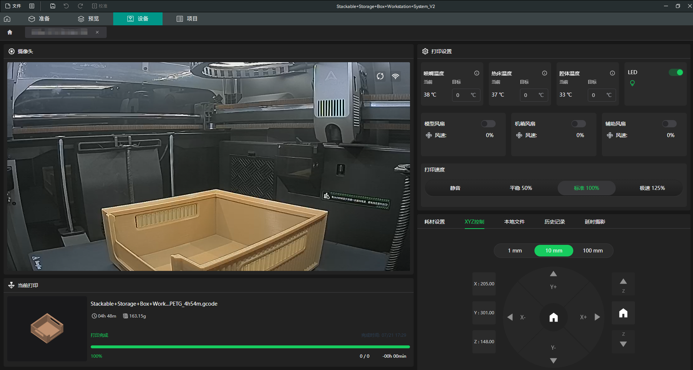

# Creality Printer Device Control Shim

由于创想三维打印机固件内Klipper版本过旧，Klipper页面无法开启摄像头，传感器数据、GCode控制等功能界面不是非常友好。社区也有一些用户通过go2rtc代理的方式将WebRTC流导出，但视频、传感器读数、控制分散在不同的入口这很分裂。

此项目为解决以上痛点,使用100%官方原生设备控制页面+桥接垫片方式，0修改0侵入性将原本Vue前端与C++的指令拦截并通过打印机Moonraker API实现，与官方切片客户端对设备的控制完全一致。从而能够实现脱离切片软件独立使用浏览器查看和控制设备，也可以与其他第三方软件集成（例如 Orca Slicer、Home Assistant等）。

通过本服务，您可以在**无需安装官方客户端、无需登录创想云账号**的情况下，以完全 100% 官方原生的 UI 和全部控制功能，直接在局域网内监控和管理您的 K2全系、K1全系等 3D 打印机。

---

## 🌟 项目特点

1. **0侵入性**：无需修改打印机配置，无需开Root，不影响原生软硬件任何功能，独立运行官方的原生 Vue 单页应用静态资源，界面与官方软件中看到的完全一致。
2. **纯局域网环境 (LAN-Only)**：彻底去除了云端绑定的依赖，自动移除“创想云绑定设备”栏目和底部登录提示，保护隐私且无外部网络连接消耗。
3. **SDP协议转换**：包含内置的 SDP 代理网关，自动客户端-打印机双向地址替换，打通 DTLS 连接，实现浏览器内视频流秒开。
4. **自适应与定制化参数**：支持通过 URL 传参直接指定 IP、打印机型号、界面语言等。

---

## 🛠️ 垫片（Shim）工作原理

为了让官方的前端 Vue 应用能够在非 C++ WebEngine 容器环境（如普通 Chrome 浏览器）下正常运行，我们在前端注入了宿主容器桥接垫片 `c++-bridge-shim.js`，其核心原理如下：

* **极简原理**: 使用express框架作为web服务，仅在请求与原生vue app之间进行一些参数和逻辑处理。
* **桥接模拟 (`window.wx`)**：拦截官方 Vue App 向 C++ 容器发送的所有 `postMessage` 指令，并模拟 C++ 端的系统响应（如设备初始化、预设机型、语言包设置等）。
* **屏蔽创想云设备组**：此服务运行于局域网环境，也不涉及广域网通信，因此移除了冗余的创想云登陆和设备控制逻辑，保持界面整洁。
* **设备详情自动跳转**：在 Vue 的 `init_device` 响应流返回 300ms 后，自动向前端触发 `forward_device_detail` 路由命令，省去了用户在列表页中手动点击“详情”的步骤，直接呈现打印面板。
* **多语言自动映射**：自动获取浏览器的 `navigator.language`，并转换为官方 i18n 字典所需的标准 Key（如 `zh_CN`, `zh_TW`, `en_GB`, `de_DE` 等），使界面语言与系统保持一致。
* **样式动态注入**：动态注入 CSS 隐藏规则，隐藏官方 Vue 页面底部的 Creality Cloud 推广与登录按钮条，不破坏其余页面的排版。

---

## 📡 接口与调用参数

服务启动后，默认端口为 `9876`。您可以通过拼接以下 URL 参数来定制页面行为：

| 参数名 | 描述 | 默认值 | 示例 |
| :--- | :--- | :--- | :--- |
| `ip` / `printerIp` | **(必填)** 打印机的局域网物理 IP 地址 | - | `?ip=192.168.X.X` |
| `mac` | 打印机的 MAC 地址 浏览器访问 http://{打印机IP}/info 可以获取 | - | `&mac=XXXXXXXXXXXX` |
| `model` | 打印机型号 | - | `&model=K1 Max` |
| `page` | 启动目标页面。设为 `list` 时停留在多设备列表，其余值自动进入详情页 | `detail` | `&page=list` |
| `lang` / `locale` | 强转界面语言（如 `zh_CN`, `zh_TW`, `en_GB`, `de_DE`） | 浏览器自适应 | `&lang=zh_CN` |

**快速启动示例 URL**：
* 中文界面、直接进入1.100这台设备的详情页：`http://localhost:9876/?ip=192.168.1.100&lang=zh_CN`
* 自动判断浏览器语言、显示设备列表页：`http://localhost:9876/?ip=192.168.1.100&page=list`

---

## 🚀 部署与启动步骤

### 1. 环境准备
确保您的计算机上已安装了 [Node.js](https://nodejs.org/)（推荐LTS版本）。

### 2. 安装依赖
```bash
npm install
```

### 3. 运行服务
在终端中启动代理服务器：
```bash
npm start
```
或者在后台以开发模式运行：
```bash
node server.js
```
成功启动后，终端将输出如下启动日志：
```text
╔══════════════════════════════════════════════════╗
║  Creality Device Proxy Server                    ║
║  Running on http://localhost:9876                ║
║                                                  ║
║  For Orca Slicer, set Device UI URL to:          ║
║  http://localhost:9876                           ║
╚══════════════════════════════════════════════════╝
```

### 4. 接入切片软件 (Orca Slicer / Bambu Studio)
1. 打开 Orca Slicer，在设备列表中点击“添加/编辑物理打印机”。
2. **“主机类型”** 和 **“打印机代理”** 配置为Creality Print 
3. **“主机名,IP或者URL”** 填写打印机IP(只填写IP即可) 
4. **“打印机代理”** 填写此服务URL+配置参数，例如：
   `http://localhost:9876/?ip=192.168.1.100&lang=zh_CN`
5. 保存并进入 Slicer 的“设备 (Device)”栏目，即可流畅开启实时画面与完整的直连控制面板！

---

## Orca Slicer 2.4.2 集成效果截图
### 打印机配置

### 上传并打印 (支持耗材映射手动选择，不支持颜色自动映射) 

### 设备标签页 (与Creality Print中使用完全一致)


---

## 💡 Q/A
1. 部署方式根据自身实际环境决定，无配置、无数据、无状态，只产生网络流量，只需要node环境+express库，推荐docker部署，也可以自己打包成exe本地运行。

2. 设备列表页面暂时未考虑多设备切换场景，不同设备的详情页区分来自url参数，切片软件中打印机配置是1对1的关系，其他场景根据不同的ip使用不同的url每台请求一次即可，因为每台设备都有心跳连接和Moonraker API的Websocket长连接。

3. 理论上打印机固件更新不影响，除非厂商将固件内组件全部都升级了或者打印机接口改变了。

4. 由于官方的在线系统预设参数不定期更新/回退导致我打印成品质量不稳定，所以我切换至使用Orca Slicer，此项目不会有更多功能添加。

## 声明
deviceMgr/assets、deviceMgr/img目录下内容来自Creality Print 7.1.0.4414客户端及其使用的开源组件，其版权和其他组件所有权属于各自的所有者。
